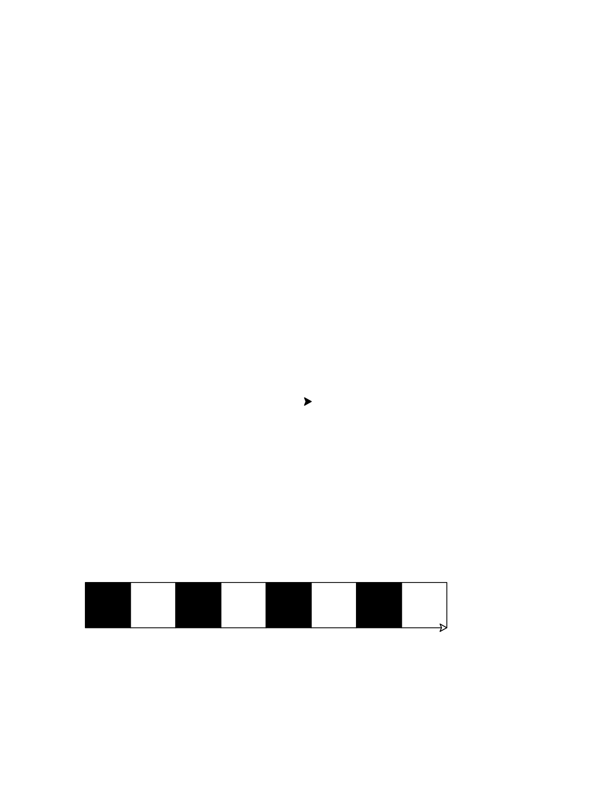
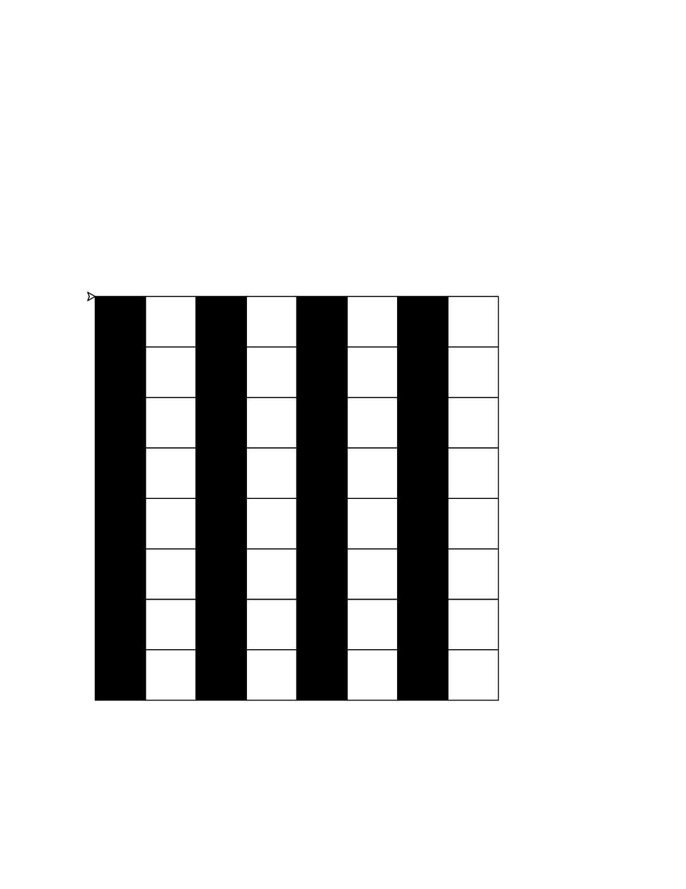
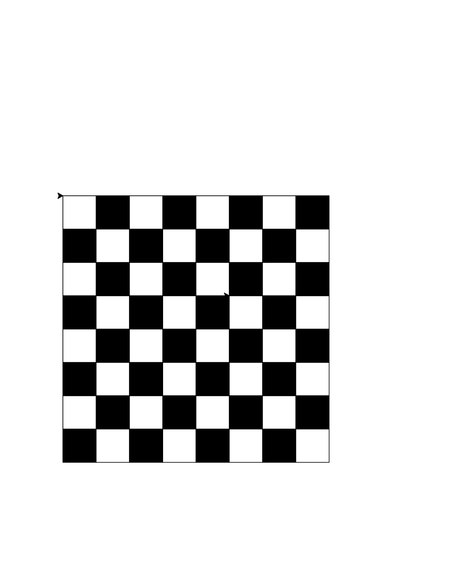
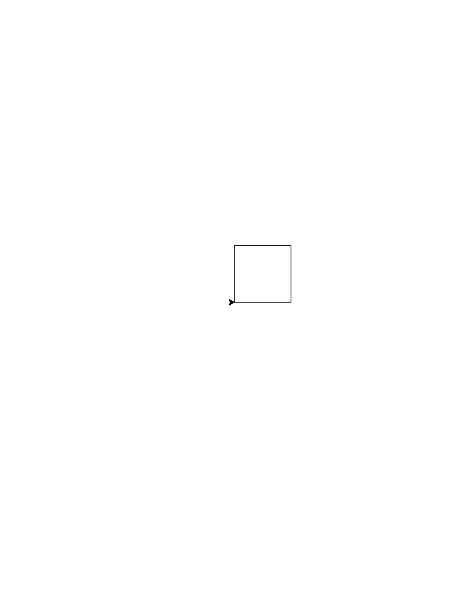
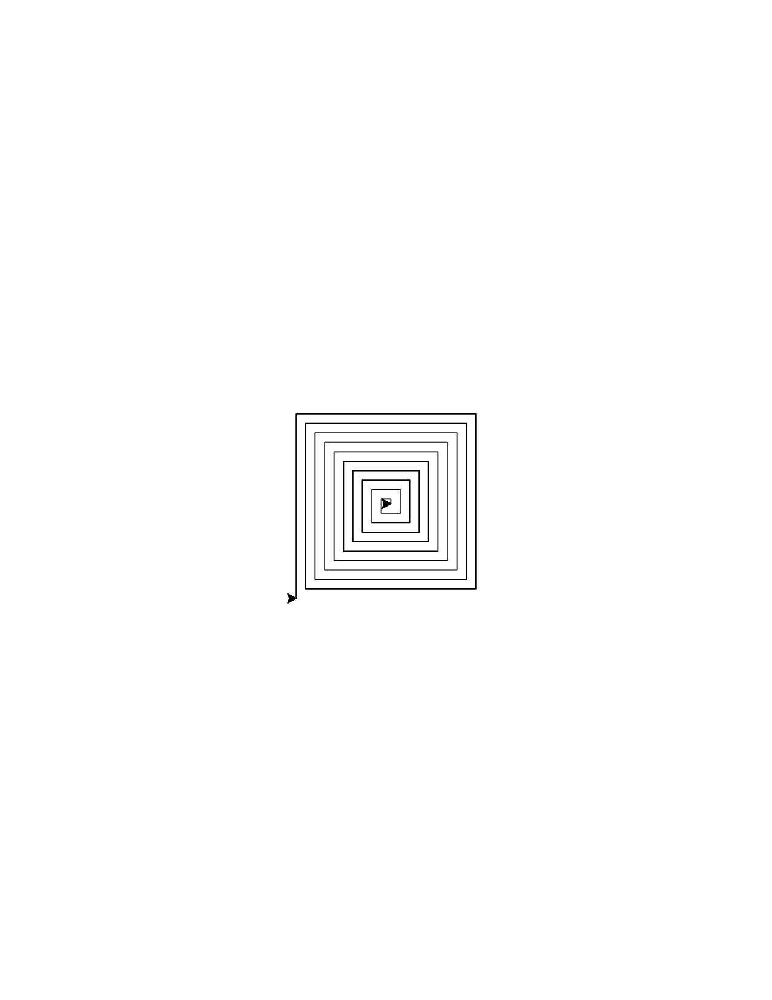
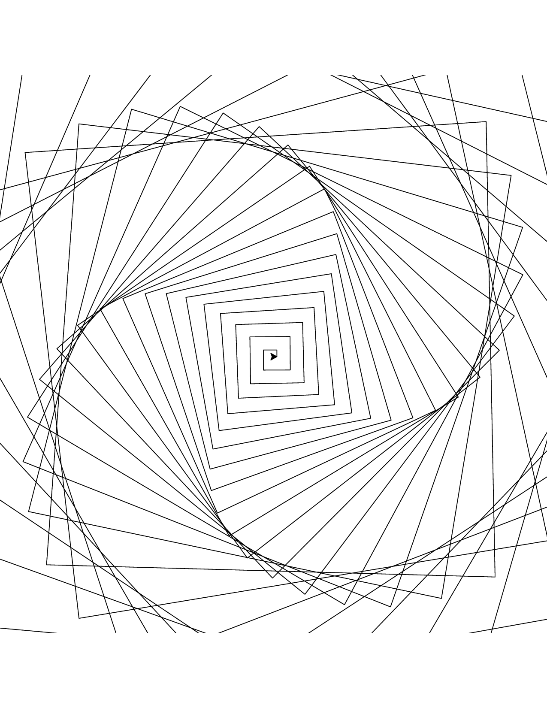
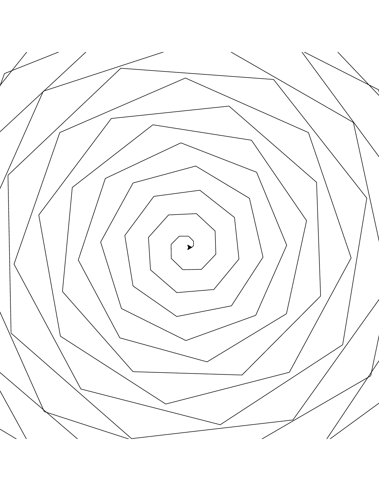
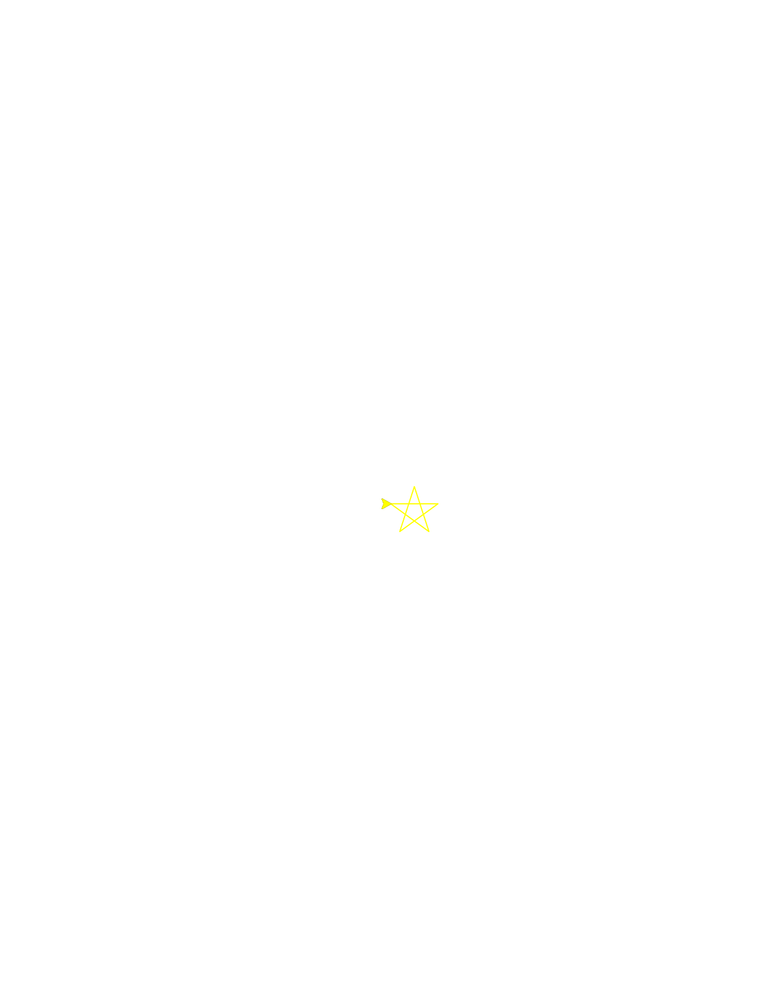
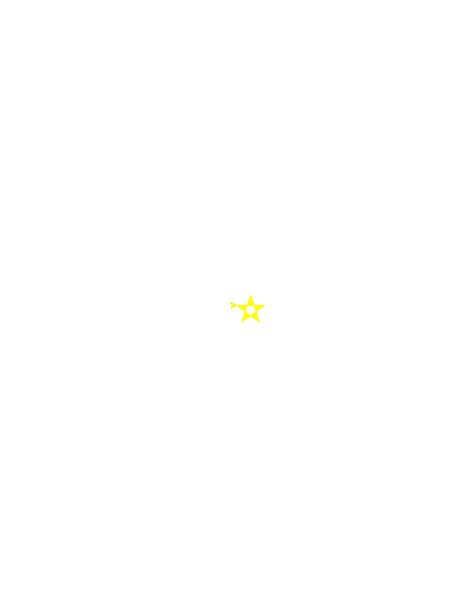
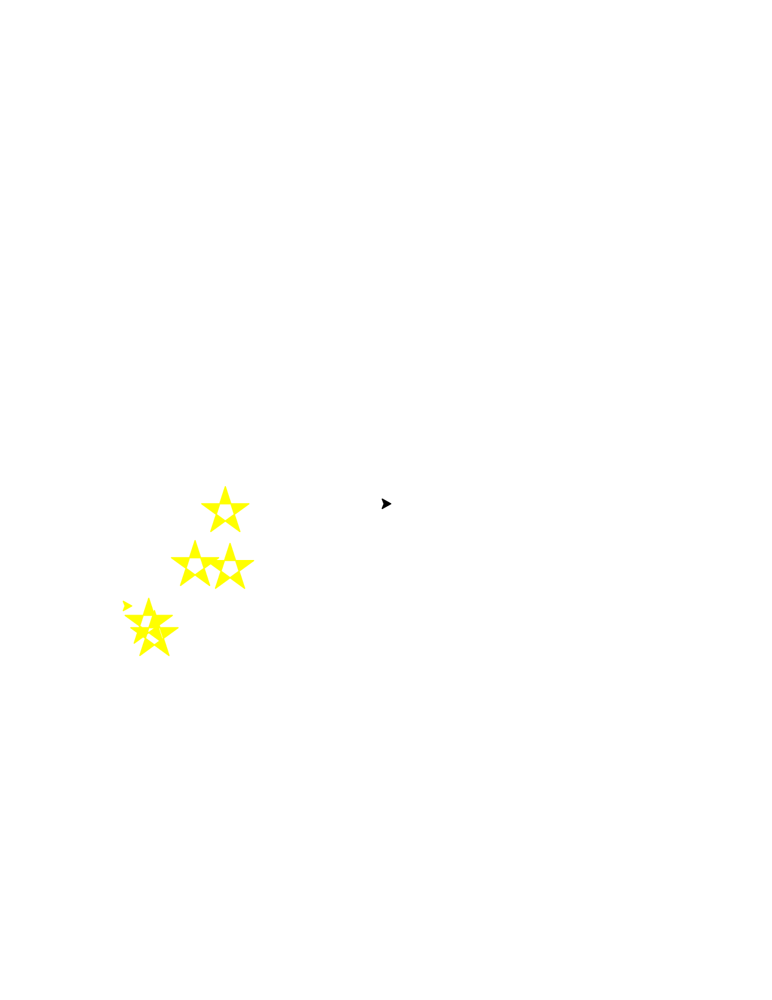

# Expected Turtle Art Results

## Results from: `chessboard.md`

### Step 1: Drawing a Row of Black Squares

### Step 2: Alternating Colors in a Row

### Step 3: Drawing the Full Grid (Basic Chessboard Structure)

### Step 4: Achieving True Chessboard Colors

## Results from: `homework.md`

## Results from: `spiraling-octagon.md`

### Step 1: Drawing a Repeated Square Path

### Step 2: Spiraling Out

### Step 3: Making it Jagged (Spiraling with Angle Change)

### Step 4: Drawing a Spiraling Octagon Shape

## Results from: `stars-in-the-sky.md`

### Step 1: Drawing a Single Star

### Step 2: Filling the Star

### Step 3: Drawing Three Stars in a Row

### Step 4: Drawing Five Randomly Placed Stars

