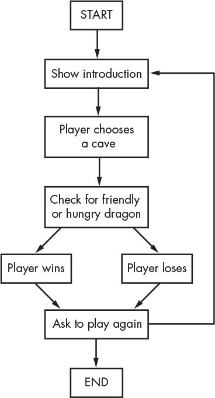
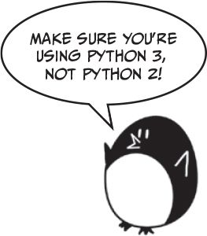
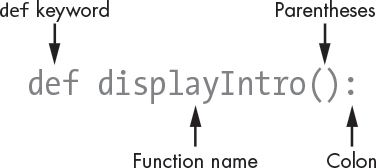

# Chapter 5: The Quest of Dragon Realm!


## An Adventure in Python Programming

**A Note on Our Adventure:** This game involves fictional dragons and choices. We're here to learn Python programming concepts in a fun, fantasy setting. We do not endorse any form of real-world violence or harm. Our dragons are strictly code!

## How to Play Dragon Realm

Brave adventurer, you stand before two caves:
* One cave hides a **friendly dragon** willing to share its treasure!
* The other, a **greedy and hungry dragon** that... well, you get the idea.

You must choose a cave (1 or 2). Will fortune favor you?

## Magical Scrolls We'll Uncover (Topics Covered)

In this chapter, we'll master new programming spells:

* 📜 **Flowcharts:** Charting our adventure's path.
* ✨ **`def` keyword:** Crafting our own magical functions.
* 📜 **Multiline strings:** Weaving long tales and descriptions.
* 🔄 **`while` statements:** Loops that continue under a condition.
* ⚖️ **Boolean operators (`and`, `or`, `not`):** The logic of choices.
* 📊 **Truth tables:** Understanding Boolean outcomes.
* 🎁 **`return` keyword:** Functions bestowing gifts (values).
* 🌍 **Global and local scope:** The realms of variables.
* 🤝 **Parameters and arguments:** Passing messages to functions.
* ⏳ **`sleep()` function:** Adding suspense to our tale.

## A Glimpse into the Adventure (Sample Run)

This is what a game session might look like. The player's input is shown after the prompt.
```text
You are in a land full of dragons. In front of you,
you see two caves. In one cave, the dragon is friendly
and will share his treasure with you. The other dragon
is greedy and hungry, and will eat you on sight.
Which cave will you go into? (1 or 2)
1
You approach the cave...
It is dark and spooky...
A large dragon jumps out in front of you! He opens his jaws and...
Eats you and spends your robux!!
Do you want to play again? (yes or no)
no
```

## Charting the Dragon's Lair: Flowcharts

Before coding, wise adventurers design their program. A flowchart is like a map showing every possible action.



*Figure 5-1: Flowchart for the Dragon Realm game. Follow the arrows from START to END.*

## The Ancient Script: Source Code for Dragon Realm

We'll now examine the Python script, `dragon.py`.

You can type this into your IDLE editor (File > New Window) and save it as `dragon.py`.



*(This is a visual representation; we'll break down the code next.)*

## Summoning Aides: Importing Modules

Our script needs help from Python's built-in magic:
```python
import random
import time
```
* `random`: For unpredictable events, like which cave has the friendly dragon (`random.randint()`).
* `time`: To control the pacing of our story (`time.sleep()`).

(This cell just shows the import statements as they appear in the script.)

## Incantations & Reusable Spells: Functions

Functions are blocks of code that perform a specific task. We define them once and can "call" (use) them many times. A variable is defined (or created) the first time we assign a value to it using the assignment operator `=`.

We've used built-in functions like `print()`, `input()`, `randint()`. Now, we'll create our own!

### The `def` Statement: Crafting a Function

We define functions using the `def` keyword. Below is the `displayIntro` function definition from our game. Running this cell defines the function, but doesn't execute its content yet.


*Figure 5-2: Parts of a `def` statement*

```python
def displayIntro_example(): # Renamed for this example slide
    print("You are in a land full of dragons. In front of you,")
    print("you see two caves. In one cave, the dragon is friendly")
    print("and will share his treasure with you. The other dragon")
    print("is greedy and hungry, and will eat you on sight.")
    print()

# To see it work, we would call displayIntro_example() in another cell.
```

### Invoking the Spell: Calling a Function

Defining a function doesn't run its code. You must *call* it:

```python
# This is a function definition
def simpleGreeting():
    print("Welcome, brave adventurer!")

# This is the function call (code inside simpleGreeting runs now)
simpleGreeting()
```

    Welcome, brave adventurer!


### The Order of Spells: Where to Define Functions

A function must be defined *before* you call it.

**Incorrect (causes an error if uncommented):**
```python
# tryToSayGoodbye() # Error! Python doesn't know this spell yet.

# def tryToSayGoodbye():
#    print('Goodbye, for now!')
```

**Correct:**

```python
def sayGoodbye():
    print('Goodbye!')

sayGoodbye() # Now Python knows the spell.
```

    Goodbye!


### ✨ Your Turn: Crafting Functions! ✨

Time to practice! In your own Python IDE (like IDLE or Thonny), try writing the following two functions:

1.  **`giveCompliment()`**: This function should print a nice compliment to the screen. For example, "Your jaw is immaculate. You must have mewed everyday." or "Your aura so strong, my screen brightness just auto-adjusted to max.".
2.  **`reciteIndonesianThemeSong()`**: This function should print a few lines from a well-known Indonesian patriotic song or theme. For example, the first few lines of "Garuda Pancasila":
    ```
    Garuda pancasila
    Akulah pendukungmu
    Patriot proklamasi
    Sedia berkorban untukmu
    ```

After you've written them, make sure to **call** both functions to see them in action!

### Solution: `giveCompliment()` and `reciteIndonesianThemeSong()`

Here's one way you could have written those functions. Compare it with what you wrote!

```python
# Solution for giveCompliment()
def giveCompliment():
    print("Tobey Maguire got bit by a spider but you? it must have been a goat because you're the greatest of all time.")

# Solution for reciteIndonesianThemeSong()
def reciteIndonesianThemeSong():
    print("Garuda pancasila")
    print("Akulah pendukungmu")
    print("Patriot proklamasi")
    print("Sedia berkorban untukmu")

# Calling the functions to test them
print("Calling giveCompliment:")
giveCompliment()
print("\nCalling reciteIndonesianThemeSong:") # \n adds a newline for better separation
reciteIndonesianThemeSong()
```

    Calling giveCompliment:
    Tobey Maguire got bit by a spider but you? it must have been a goat because you're the greatest of all time.
    
    Calling reciteIndonesianThemeSong:
    Garuda pancasila
    Akulah pendukungmu
    Patriot proklamasi
    Sedia berkorban untukmu


## Weaving Long Tales: Multiline Strings

For text that spans multiple lines, use triple quotes (`'''` or `"""`). This makes your code much cleaner than using many `print()` statements or `\n` new-line characters.

```python
intro_message = '''This is a tale of ancient lore,
spread across several lines,
telling of dragons and treasure galore.'''

print(intro_message)
```

    This is a tale of ancient lore,
    spread across several lines,
    telling of dragons and treasure galore.


### ✨ Your Turn: Revisiting with Multiline Strings! ✨

Remember the `reciteIndonesianThemeSong()` function you wrote earlier?

Now, try to **revise** that function in your IDE. This time, use a **multiline string** to store and print the song lyrics, instead of using multiple `print()` statements.

### Solution: `reciteIndonesianThemeSong()` with Multiline String

Here's how you could revise the function using a multiline string:

```python
# Revised solution for reciteIndonesianThemeSong() using a multiline string
def reciteIndonesianThemeSong_multiline():
    song_lyrics = '''Garuda pancasila
Akulah pendukungmu
Patriot proklamasi
Sedia berkorban untukmu'''
    print(song_lyrics)

# Calling the revised function
print("Calling reciteIndonesianThemeSong_multiline:")
reciteIndonesianThemeSong_multiline()
```

    Calling reciteIndonesianThemeSong_multiline:
    Garuda pancasila
    Akulah pendukungmu
    Patriot proklamasi
    Sedia berkorban untukmu


## Persistent Magic: `while` Loops

A `while` loop repeats code as long as its condition is `True`.

```python
# Example:
count = 0
print("Starting the count...")
while count < 3:
    print("Still counting... (count is " + str(count) + ")") # Using str() to convert int to string for concatenation
    count = count + 1 # or count += 1
print("Done counting!")
```

    Starting the count...
    Still counting... (count is 0)
    Still counting... (count is 1)
    Still counting... (count is 2)
    Done counting!


In `dragon.py`, the `chooseCave()` function uses a `while` loop for input validation:
```python
# Snippet from chooseCave():
#    cave = ''
#    while cave != '1' and cave != '2': # Loop until valid input
#        print('Which cave will you go into? (1 or 2)')
#        cave = input()
#    return cave
```
(This snippet is illustrative as `input()` is harder to demo in static slides).

## The Logic of Choice: Boolean Operators

Boolean operators (`and`, `or`, `not`) work with `True` / `False` values.
They help us make complex decisions.

### The `and` Operator

`A and B` is `True` only if *both* A and B are `True`.

**Truth Table for `and`:**
| A     | B     | A and B |
|-------|-------|---------|
| `True`  | `True`  | `True`  |
| `True`  | `False` | `False` |
| `False` | `True`  | `False` |
| `False` | `False` | `False` |

Let's test it with an age and height check for a theme park ride:

```python
min_age = 10
min_height_cm = 120

current_age = 12
current_height_cm = 130

is_old_enough = (current_age >= min_age)
is_tall_enough = (current_height_cm >= min_height_cm)

can_enter_ride = is_old_enough and is_tall_enough

print("Current age: " + str(current_age) + ", Minimum age: " + str(min_age))
print("Is old enough? " + str(is_old_enough))
print("Current height (cm): " + str(current_height_cm) + ", Minimum height (cm): " + str(min_height_cm))
print("Is tall enough? " + str(is_tall_enough))
print("Can enter ride? " + str(can_enter_ride))

current_age_2 = 8 # Too young
current_height_cm_2 = 125 # Tall enough
can_enter_ride_2 = (current_age_2 >= min_age) and (current_height_cm_2 >= min_height_cm)
print("\nSecond check (Age: " + str(current_age_2) + ", Height: " + str(current_height_cm_2) + ")")
print("Can enter ride? " + str(can_enter_ride_2))
```

    Current age: 12, Minimum age: 10
    Is old enough? True
    Current height (cm): 130, Minimum height (cm): 120
    Is tall enough? True
    Can enter ride? True
    
    Second check (Age: 8, Height: 125)
    Can enter ride? False


### The `or` Operator

`A or B` is `True` if *at least one* of A or B is `True`.

**Truth Table for `or`:**
| A     | B     | A or B  |
|-------|-------|---------|
| `True`  | `True`  | `True`  |
| `True`  | `False` | `True`  |
| `False` | `True`  | `True`  |
| `False` | `False` | `False` |

Example from `dragon.py` (line 36): `playAgain == 'yes' or playAgain == 'y'`

```python
print("True or False is: " + str(True or False))
print("False or False is: " + str(False or False))

has_potion = False
has_spell = True
can_fight_monster = has_potion or has_spell
print("Can fight monster? " + str(can_fight_monster))
```

    True or False is: True
    False or False is: False
    Can fight monster? True


### The `not` Operator

`not A` gives the opposite Boolean value of A.

**Truth Table for `not`:**
| A     | not A   |
|-------|---------|
| `True`  | `False` |
| `False` | `True`  |

```python
print("not True is: " + str(not True))
is_daytime = False
is_nighttime = not is_daytime
print("Is it nighttime? " + str(is_nighttime))
```

    not True is: False
    Is it nighttime? True


### Evaluating Booleans in `chooseCave()`

Line 13: `while cave != '1' and cave != '2':`

* If `cave` is `''` (initially):
    * `'' != '1'` is `True`.
    * `'' != '2'` is `True`.
    * So, `True and True` is `True`. The loop continues.
* If player enters `'1'`:
    * `'1' != '1'` is `False`.
    * The `and` condition becomes `False and ...` which is `False`. The loop stops.
* This ensures the player enters either '1' or '2'. This is called **input validation**.

(This slide is explanatory text.)

## A Function's Gift: Return Values

The `return` statement sends a value back from a function.

In `dragon.py` (line 17), `chooseCave()` returns the player's valid choice.

```python
# def chooseCave():
#    ... (code to get valid input '1' or '2') ...
#    return cave
```
When `chooseCave()` is called (line 38: `caveNumber = chooseCave()`), the returned value (`'1'` or `'2'`) is stored in `caveNumber`.

Here's a simpler example of a function that returns a value:

```python
def getPassword():
    # In a real app, this would be more complex!
    secret_password = "swordfish"
    return secret_password

my_secret = getPassword()
print("The function returned: " + my_secret)
```

    The function returned: swordfish


### ✨ Your Turn: Returning a Value! ✨

Let's create a function that returns a specific piece of information.

In your IDE, write a function called `getIndependenceDay()`. This function should:
* Take no arguments.
* Return the date of Indonesia's Independence Day as a string (e.g., "17 Agustus").

After writing the function, call it and print the returned value to check your work.

### Solution: `getIndependenceDay()`

Here's how you could write the `getIndependenceDay()` function:

```python
# Solution for getIndependenceDay()
def getIndependenceDay():
    indonesia_independence_day = "17 Agustus"
    return indonesia_independence_day

# Calling the function and printing its return value
date_returned = getIndependenceDay()
print("Indonesia's Independence Day is on: " + date_returned)
```

    Indonesia's Independence Day is on: 17 Agustus


## Realms of Variables: Global vs. Local Scope

* A variable is **defined** (or created) the first time we assign a value to it using the assignment operator (`=`).
* **Local Scope:** Variables defined *inside* a function. They exist only while the function is running.
    * Once the function finishes executing, its local variables **disappear** and their values are forgotten.
* **Global Scope:** Variables defined *outside* all functions. They exist for the entire program.

The main usefulness of having local and global scopes is to **prevent variable conflicts**. You can use the same variable name inside a function (local) as outside (global) without them interfering with each other. Python will treat them as two separate variables. This helps keep code in different parts of your program from accidentally changing each other's data.

### Scope Example: The Tale of Two `spam`s

Observe how the `spam` variable behaves. `spam` inside `bacon()` is a local variable, different from the global `spam`.

```python
def bacon():
    spam = 99      # This 'spam' is LOCAL to bacon(). It's defined here.
    print("Inside bacon(), local spam is: " + str(spam))

spam = 42          # This 'spam' is GLOBAL. It's defined here.
print("Before calling bacon(), global spam is: " + str(spam))

bacon()            # Calls bacon(). The local 'spam' (99) is used. The global 'spam' (42) is unaffected.

print("After calling bacon(), global spam is still: " + str(spam)) # Global 'spam' remains 42. The local 'spam' from bacon() is gone.
```

    Before calling bacon(), global spam is: 42
    Inside bacon(), local spam is: 99
    After calling bacon(), global spam is still: 42


## Passing Messages: Function Parameters & Arguments

A **parameter** is a variable in a function definition that receives a value when the function is called. Think of it as a placeholder in the function.
An **argument** is the actual value that is passed to the function when it is called.

```python
# 'chosenCave' is a PARAMETER in the original game's checkCave function
# def checkCave(chosenCave):
#     print('You chose cave number: ' + chosenCave)
#     # ... more code ...
```
When `checkCave(caveNumber)` is called (line 39 in `dragon.py`), the value stored in the `caveNumber` variable is the **argument** passed to the `chosenCave` parameter.

### Parameters Example: `sayHello`

The `sayHello` function takes one parameter, `name_param`.

```python
def sayHello(name_param): # 'name_param' is a parameter
    message = "Hello, " + name_param + ". Your name has " + str(len(name_param)) + " letters."
    print(message)

sayHello('Alice')     # 'Alice' is an argument
sayHello('Bob')       # 'Bob' is an argument
wizard_name = 'Gandalf'
sayHello(wizard_name) # The value of wizard_name ('Gandalf') is an argument
```

    Hello, Alice. Your name has 5 letters.
    Hello, Bob. Your name has 3 letters.
    Hello, Gandalf. Your name has 7 letters.


### ✨ Your Turn: Functions with Parameters! ✨

Now it's time to create a function that accepts an argument.

In your IDE, write a function called `congratulate(name)`.
* This function should take one parameter, `name`.
* Inside the function, it should print a congratulatory message to that person for a special occasion. For example, if the name is "Budi", it could print "Selamat, Budi, atas pencapaian luar biasamu!" (Congratulations, Budi, on your outstanding achievement!).

After writing it, call the function a few times with different names as arguments.

### Solution: `congratulate(name)`

Here's one way to write the `congratulate(name)` function:

```python
# Solution for congratulate(name)
def congratulate(name):
    occasion_message = "atas mewing streak kamu!"
    print("Selamat, " + name + ", " + occasion_message)

# Calling the function with different arguments
congratulate("Ani")
congratulate("Eko")
congratulate("Siti")
```

    Selamat, Ani, atas mewing streak kamu!
    Selamat, Eko, atas mewing streak kamu!
    Selamat, Siti, atas mewing streak kamu!


## Building Suspense: Displaying Game Results with `time.sleep()`

The `time.sleep()` function pauses the program for a number of seconds. This adds drama!
Shorter pauses are used in this demo cell.

```python
import time # Make sure time is imported for this cell

print('You approach the cave...')
time.sleep(0.5)  # Pause for 0.5 seconds
print('It is dark and spooky...')
time.sleep(0.5)  # Pause for 0.5 seconds
print('A large dragon jumps out in front of you! He opens his jaws and...')
time.sleep(0.5)  # Pause for 0.5 seconds
print("...the story continues!")
```

    You approach the cave...
    It is dark and spooky...
    A large dragon jumps out in front of you! He opens his jaws and...
    ...the story continues!


## Fate's Choice: Deciding the Friendly Dragon

How does the game decide which dragon is friendly?

```python
# Snippet from checkCave(chosenCave):
# friendlyCave_num = random.randint(1, 2)
#
# if chosenCave == str(friendlyCave_num):
#     print('Gives you his treasure!')
# else:
#     print('Eats you and spends your robux!!')
```
* `random.randint(1, 2)`: Randomly picks 1 or 2.
* `str(friendlyCave_num)`: Converts the integer `friendlyCave_num` to a string. This is crucial because `chosenCave` (from `input()`) is a string.

Let's simulate this choice:

```python
import random # Ensure random is imported

# Simulate player's choice
possible_choices = ['1', '2']
player_chosen_cave_str = random.choice(possible_choices) # Player randomly picks '1' or '2'
print("Player chose cave: " + player_chosen_cave_str)

# Determine the friendly dragon's cave
friendly_dragon_cave_int = random.randint(1, 2)
friendly_dragon_cave_str = str(friendly_dragon_cave_int)
print("The friendly dragon is in cave: " + friendly_dragon_cave_str)

# Check the outcome
if player_chosen_cave_str == friendly_dragon_cave_str:
    print('Gives you his treasure!')
else:
    print('Eats you and spends your robux!!')
```

    Player chose cave: 2
    The friendly dragon is in cave: 1
    Eats you and spends your robux!!


## The Adventure Continues: The Main Game Loop

The game allows playing multiple times using a `while` loop:

```python
# Structure of the main game loop in dragon.py
playAgain = 'yes'
while playAgain == 'yes' or playAgain == 'y':
    # ... game logic starts here ...
    displayIntro()
    caveNumber = chooseCave()
    checkCave(caveNumber)
    # ... game logic ends ...

    print('Do you want to play again? (yes or no)')
    playAgain = input()
```
* `playAgain` is initialized to `'yes'` to ensure the loop runs at least once.
* The loop continues based on player's input.
* Our custom functions are called to run the game.
(This is a structural overview, `input()` makes direct demo in static slides tricky).

## The Complete Scroll: `dragon.py`

Below is the entire script for Dragon Realm. This code cell contains the full game. If you were running this notebook interactively (and not just viewing slides), you could execute this cell to play the game (it would prompt for input in your Jupyter interface).

```python
# dragon.py (Full Source Code)
import random
import time

def displayIntro():
    print('''You are in a land full of dragons. In front of you,
you see two caves. In one cave, the dragon is friendly
and will share his treasure with you. The other dragon
is greedy and hungry, and will eat you on sight.''')
    print()

def chooseCave():
    cave = ''
    # Input validation loop
    while cave != '1' and cave != '2':
        print('Which cave will you go into? (1 or 2)')
        cave = input() # Jupyter will show an input box here if run interactively
    return cave

def checkCave(chosenCave_param): # Renamed parameter to avoid conflict if cell is run multiple times
    print('You approach the cave...')
    time.sleep(1) # Slightly shorter sleeps for faster game in demo
    print('It is dark and spooky...')
    time.sleep(1)
    print('A large dragon jumps out in front of you! He opens his jaws and...')
    print() # Adds a blank line for readability
    time.sleep(1)

    friendlyCave_num = random.randint(1, 2)

    if chosenCave_param == str(friendlyCave_num):
        print('Gives you his treasure!')
    else:
        print('Eats you and spends your robux!!')

# Main game loop
# playAgain = 'yes' # This variable would control the loop
# To actually run the game from this cell, you'd uncomment the loop
# and the initial 'playAgain' and run the cell. For static slides,
# we usually don't run interactive input loops.

# Example of how the main game loop would start:
# print("--- Starting Dragon Realm Game (Conceptual Run) ---")
# displayIntro()
# player_choice = chooseCave() # This would prompt for input
# checkCave(player_choice)
# print("--- End of Conceptual Run ---")
# print("To play fully, you'd need the 'playAgain' loop and run this cell interactively.")
```

## Treasures Unlocked: Summary

In our Dragon Realm quest, we learned:
* **Functions (`def`)** organize code into reusable blocks.
* **Arguments & Parameters** pass data to functions.
* **Return values** get data back from functions.
* **Scopes (local/global)** determine where variables live and help prevent conflicts.
* **Boolean logic (`and`, `or`, `not`)** helps make decisions.
* **`while` loops** repeat code based on a condition.
* **`time.sleep()`** adds pauses for effect.
* **`random.randint()`** introduces unpredictability.

Functions are fundamental to writing clean, manageable, and powerful Python programs!

## Your Quest is Complete!

You've bravely faced the Dragon Realm and learned valuable Python spells!


What adventures will you code next?

(Reminder: Images from the tutorial like `images/00016.jpeg` need to be in an 'images' subdirectory for them to display.)

### Notes for Presenter (and to ensure images work):

1.  Make sure you have an `images` folder in the same directory as this Jupyter Notebook.
2.  Place the images from the tutorial (`00016.jpeg`, `00061.jpeg`, `00062.jpeg`, `00064.jpeg`) into that `images` folder.
3.  The treasure chest image is linked from an external source for variety.
4.  To run these slides:
    * Make sure you have `nbconvert` and its dependencies: `pip install jupyter nbconvert`
    * From your terminal, navigate to the directory containing this notebook and run:
        `jupyter nbconvert your_notebook_name.ipynb --to slides --post serve --ExecutePreprocessor.enabled=True --execute`
        (Replace `your_notebook_name.ipynb` with the actual filename).
    * Using `--execute` will run the cells and embed their outputs. Be cautious with cells that expect `input()` if you pre-execute for static slides, as they might cause the conversion to hang or require default input handling. For the full `dragon.py` cell, it's mostly commented out to prevent issues with `input()` during automatic execution for slide generation.
    * For a better interactive slide experience with `input()`, tools like RISE (`pip install RISE`) are recommended, which allow live execution within the slideshow.
