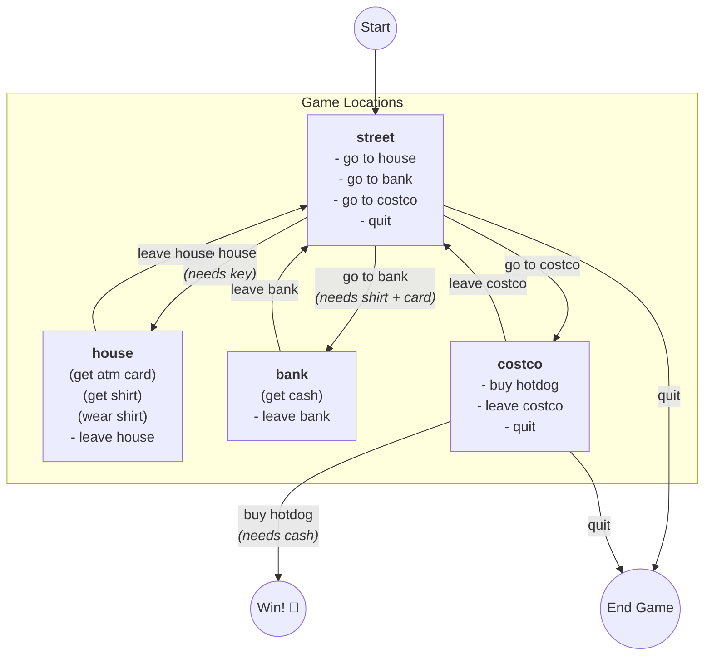

```mermaid
graph TD
    Start((Start)) --> street;

    subgraph "Game Locations"
        direction TB
        street["<b>street</b><br/>- go to house<br/>- go to bank<br/>- go to costco<br/>- quit"];
        house["<b>house</b><br/>(get atm card)<br/>(get shirt)<br/>(wear shirt)<br/>- leave house"];
        bank["<b>bank</b><br/>(get cash)<br/>- leave bank"];
        costco["<b>costco</b><br/>- buy hotdog<br/>- leave costco<br/>- quit"];
    end

    Win((Win! 🌭));
    End((End Game));

    street -- "go to house<br/><i>(needs key)</i>" --> house;
    street -- "go to bank<br/><i>(needs shirt + card)</i>" --> bank;
    street -- "go to costco" --> costco;
    street -- "quit" --> End;

    house -- "leave house" --> street;
    bank -- "leave bank" --> street;
    
    costco -- "buy hotdog<br/><i>(needs cash)</i>" --> Win;
    costco -- "leave costco" --> street;
    costco -- "quit" --> End;
```