```mermaid
graph TD
    Start((Start)) --> street;

    subgraph "Game Locations"
        direction TB
        street["<b>street</b><br/>- go to costco<br/>- quit"];
        costco["<b>costco</b><br/>- buy hotdog<br/>- leave costco<br/>- quit"];
    end

    Win((Win! 🌭));
    End((End Game));

    street -- "go to costco" --> costco;
    street -- "quit" --> End;

    costco -- "buy hotdog" --> Win;
    costco -- "leave costco" --> street;
    costco -- "quit" --> End;

```

### Step 1: Define the Game's "State"

First, you need to store the information that will change during the game. In our MVP, that's just the player's data. We use a dictionary for this.

```python
# --- GAME STATE ---
player = {
    "location": "street",  # The player starts on the street.
    "hotdog_count": 0
}
```

### Step 2: Define the Game's "Rules"

Next, define the "constant" rules of the game—what actions are possible in what locations? This won't change. A dictionary is perfect here, mapping a location (key) to a list of actions (value).

```python
# This dictionary defines all possible actions for each location.
AVAILABLE_ACTIONS = {
    "street": ["go to costco", "quit"],
    "costco": ["buy hotdog", "leave costco", "quit"]
}
```

### Step 3: Create the Main "Game Loop"

Now, you create the "heartbeat" of the game. This is a function that will run forever until the player quits or wins. We use a `while True:` loop for this. We also add the `if __name__ == "__main__":` block so we can run the file.

```python
# --- MAIN GAME LOOP ---
def play_game():
    """The main function to run the game."""
    print("=== WELCOME TO THE HOTDOG QUEST! ===")

    while True:
        # We will fill this in
        print("The loop is running...")
        break # Add a break just for testing, we'll remove it

play_game()
```

*At this point, you can run the file. It will print the welcome message and "The loop is running..." once, then stop.*

### Step 4: Show the Player What's Happening

Inside the loop, the player needs to know what's going on. Let's create a function to show their status and call it *inside* the loop.

```python
# --- HELPER FUNCTIONS ---
def show_status(current_player):
    """Prints the player's current status."""
    print("\n" + "="*20)
    print(f"LOCATION: {current_player['location']}")
    print(f"HOTDOGS: {current_player['hotdog_count']}")
    print("="*20)

# --- MAIN GAME LOOP ---
def play_game():
    # ... (welcome message and player.copy()) ...
    while True:
        # 1. Show the player's current status
        show_status(current_player) 
        break # Still just testing
```

*Now when you run it, it will show the starting status: LOCATION: street, HOTDOGS: 0.*

### Step 5: Show the Player What They Can Do

Next, let's show them their possible actions based on their *current location*. We'll add another helper function and call it in the loop.

```python
# --- HELPER FUNCTIONS ---
# ... (show_status function) ...

def show_possible_actions(location):
    """Prints the actions available at the current location."""
    print("ACTIONS:")
    actions = AVAILABLE_ACTIONS.get(location, [])
    for i, action in enumerate(actions, 1):
        print(f"  {i}. {action}")
    print("="*20)

# --- MAIN GAME LOOP ---
def play_game():
    # ... (welcome message and player.copy()) ...
    while True:
        # 1. Show status
        show_status(current_player)
        
        # 2. Show actions
        current_location = current_player["location"]
        show_possible_actions(current_location)
        break # Still testing
```

*Run it now. It shows the status AND the actions: "1. go to costco", "2. quit".*

### Step 6: Get the Player's Input

The game is showing things, but it's not interactive. We need to get the player's choice. We'll create a function for this that *validates* their input. Then we'll remove that test `break`.

```python
# --- HELPER FUNCTIONS ---
# ... (show_status and show_possible_actions) ...

def get_player_choice(location):
    """Gets and validates the player's action choice."""
    actions = AVAILABLE_ACTIONS.get(location, [])
    
    while True: # This is an inner loop just for getting valid input
        choice = input("What do you want to do?: ").strip().lower()
        
        # Check if they entered a number (like '1')
        if choice.isdigit():
            index = int(choice) - 1
            if 0 <= index < len(actions):
                return actions[index]  # Return the action string, e.g., "go to costco"
        
        # Check if they entered the full action string (like 'go to costco')
        if choice in actions:
            return choice
            
        print(f"Invalid choice. Please try again.")

# --- MAIN GAME LOOP ---
def play_game():
    # ... (welcome message and player.copy()) ...
    while True:
        # 1. Show status
        show_status(current_player)
        # 2. Show actions
        current_location = current_player["location"]
        show_possible_actions(current_location)
        
        # 3. Get the player's choice
        choice = get_player_choice(current_location)
        
        # 4. Handle the "quit" action
        if choice == "quit":
            print("\n>>> Thanks for playing. Goodbye!")
            break # This breaks the main game loop
            
        # We will handle other actions next
        print(f"You chose: {choice}") # Test line
```

*Now you have a real loop\! It will show status, show actions, and ask for input. If you type "quit", it stops. If you type anything else, it just repeats.*

### Step 7: Make the Actions *Do* Something

This is the core logic. We need a function that *changes the `current_player` dictionary* based on the `choice`.

```python
# --- ACTION HANDLER FUNCTIONS ---
def handle_action(current_player, choice):
    """Handles all player actions."""
    location = current_player["location"]
    
    if location == "street":
        if choice == "go to costco":
            current_player["location"] = "costco" # <-- STATE CHANGE
            print("\n>>> You went to Costco.")
    
    elif location == "costco":
        if choice == "buy hotdog":
            current_player["hotdog_count"] += 1 # <-- STATE CHANGE
            print(f"\n>>> You bought a delicious hotdog!")
        elif choice == "leave costco":
            current_player["location"] = "street" # <-- STATE CHANGE
            print("\n>>> You left Costco.")

# --- MAIN GAME LOOP ---
def play_game():
    # ... (inside the while True loop) ...
    
        # 4. Handle "quit"
        if choice == "quit":
            print("\n>>> Thanks for playing. Goodbye!")
            break
            
        # 5. Process the action
        handle_action(current_player, choice)
        
        # (We removed the test print line)
```

*Now the game is functional\! You can type "go to costco", and on the *next* loop, `show_status` will print "LOCATION: costco" and `show_possible_actions` will show the Costco actions.*

### Step 8: Add the "Win Condition"

The last step is to check if the player has won. We add this check at the *end* of the loop.

```python
# --- MAIN GAME LOOP ---
def play_game():
    # ... (inside the while True loop) ...
            
        # 5. Process the action
        handle_action(current_player, choice)
            
        # 6. Check for the win condition
        if current_player["hotdog_count"] > 0:
            print("\n=== CONGRATULATIONS! ===")
            print("You successfully bought a hotdog!")
            print("==========================")
            break # Break the loop to end the game
```
